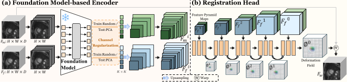

# FMIR
**A Foundation Model-Based Framework for Robust Medical Image Registration**  
*Accepted at ISBI 2026*

# FMIR: A Foundation Model-Based Image Registration Framework

[](https://pytorch.org/)
[](https://opensource.org/licenses/MIT)
[](https://arxiv.org/abs/2601.17529v2)

This repository hosts the official PyTorch implementation of **"FMIR: A Foundation Model-based Image Registration Framework for Robust Image Registration"**.

FMIR leverages 2D foundation models (e.g., DINOv3, SAM) pre-trained on large-scale natural images to achieve state-of-the-art (SOTA) in-domain performance while maintaining exceptional robustness on out-of-domain medical images. By combining a foundation model-based feature encoder with a multi-scale pyramid registration head, FMIR provides a viable path toward generalizable medical imaging models with limited resources.

---

## ✨ Highlights

**Robust Generalization**: Maintains strong performance on out-of-domain images even when trained on a single dataset.

**Plug-and-Play Backbone**: Compatible with various foundation encoders like DINO and SAM without structural changes.

**Channel Regularization (CR)**: A novel strategy that suppresses dataset-specific biases, forcing the model to learn essential structural correlations.

**High Efficiency**: Achieves superior accuracy with significantly less inference time compared to other foundation-based frameworks like uniGradICON.

---

## 🛠 Methodology



Fig 1. The schema of FMIR: (a) Foundation Model-based Encoder and (b) Registration Head.

### 1. Foundation Model-based Encoder
This module decomposes 3D volumes into 2D slices to leverage frozen 2D foundation models for domain-invariant feature extraction. It includes a **Channel Regularization** strategy to reduce dimensionality and suppress 3D-specific biases.

### 2. Registration Head
A multi-scale pyramid structure that estimates deformation fields from coarse to fine scales, effectively handling large displacements by progressively reconstructing the field.

---

## 🛠 Pretrained models

Please download the pretrained weights for [DINOv3](https://github.com/facebookresearch/dinov3?tab=readme-ov-file) and [SAM](https://github.com/facebookresearch/segment-anything)  from their official repositories and place the downloaded files into the ./weight directory.


## 🚀 Usage

### Training and Testing
You can run the following commands to train or evaluate the FMIR model. For cross-domain testing (Zero-shot), ensure the corresponding foundation encoder is specified. 

```bash
# Train on ACDC
python train_registration_all.py -m regdino_mlp -d acdcreg -bs 1 --num_classes 4 --gpu_id 0 --epochs 301 start_channel=32 --img_size '(128,128,16)' --upscale '(2,2,1)'

# Train on Abdomen CT 
python train_registration_all.py -m regdino_mlp -d abdomenreg -bs 1 --num_classes 4 --gpu_id 0 --epochs 301 start_channel=32 --img_size '(192//2,160//2,256//2)' --upscale '(2,2,2)'

# Test on ACDC
python test_cardiacreg_fbir.py -d acdcreg -m regdino_mlp --is_save 0 start_channel=32 --gpu_id 1

# Test on Abdomen CT 
python test_abdomenreg_fbir.py -d abdomenreg -m regdino_mlp --is_save 0 start_channel=32 --gpu_id 1
```

## ✨ Citation

If you find this work useful for your research, please cite our paper:
```
@article{zhang2026fmir,
  title={FMIR, A FOUNDATION MODEL-BASED IMAGE REGISTRATION FRAMEWORK FOR ROBUST IMAGE REGISTRATION},
  author={Zhang, Fengting and He, Yue and Liu, Qinghao and Wang, Yaonan and Chen, Xiang and Zhang, Hang},
  journal={arXiv preprint arXiv:2601.17529},
  year={2026}
}
```

## 🛠 Acknowledgment
We extend our sincere appreciation to [DINOv3](https://github.com/facebookresearch/dinov3?tab=readme-ov-file) and [SAM](https://github.com/facebookresearch/segment-anything) for their important contributions. Portions of the code in this repository are adapted from these projects.
